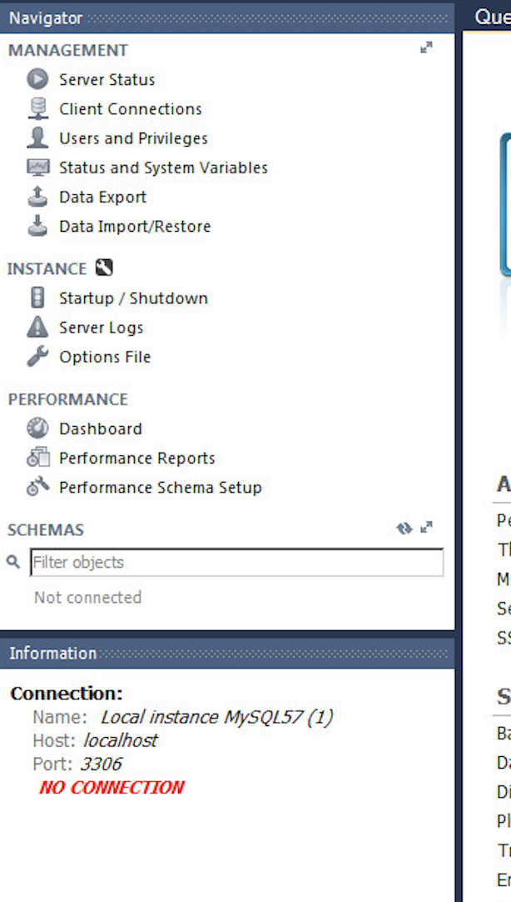

# 8. MySQL & workbench

MySQL and workbench often are difficult to install. If you didn't manage to connect MySQL to workbench, follow these steps:

## How to know if MySQL and Workbench don't work:

- 8.1 Open MySQLWorkbench
- 8.1.Click on the `+` button
- 8.1. Create a connection (your password will probably be admin)

After creating it, if you see somehting like (no connection warning):

**go to:** https://github.com/breogann/data-pre-reqs/blob/master/08.1-reinstalling.md

However, if what you see is this (no warning):

**go to:** https://github.com/breogann/data-pre-reqs/blob/master/08.2-hands-on-workbench.md

